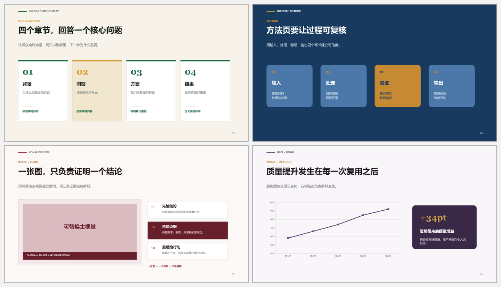
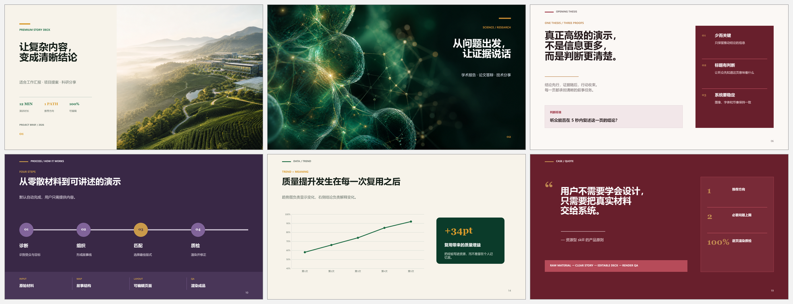
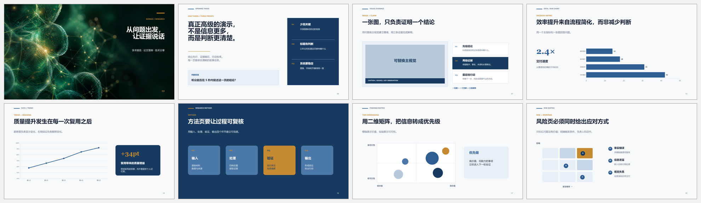
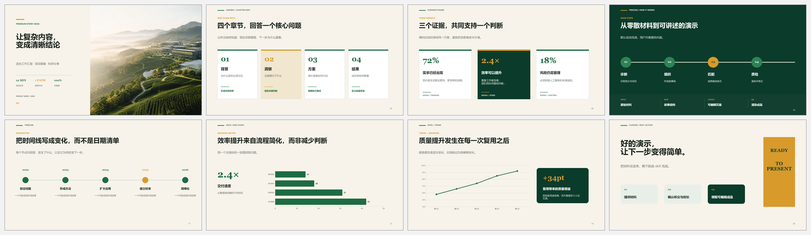
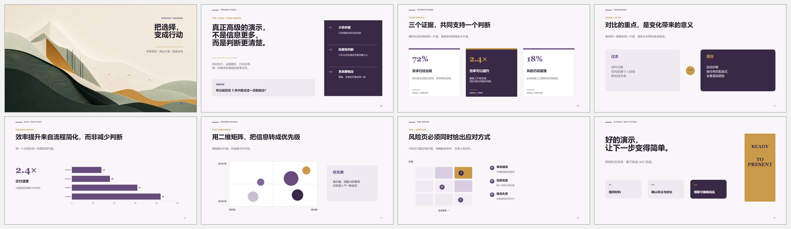
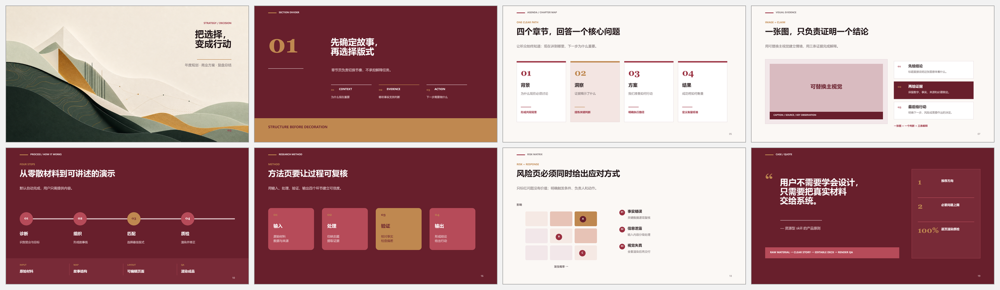

<div align="center">

# PPT Auto Studio

**把材料交进来，把可编辑的高级 PPT 拿走。**  
**Drop in your content. Get a polished, editable presentation.**

`Beginner-first` · `4 auto-selected themes` · `Editable PPTX` · `Render QA`

</div>


## 不会设计，也能做好 PPT / Great slides without design skills

这不是“再给你一堆模板，让你自己慢慢挑”。把 Word、PDF、Excel、图片、实验结果、会议笔记或旧 PPT 交给 Skill，它会自动完成内容筛选、故事线、版式匹配、视觉补充、逐页渲染和质量检查。

This is not another template dump. Give the Skill a document, spreadsheet, research result, image set, meeting note, or old deck. It organizes the story, selects layouts, adds useful visuals, builds editable slides, and checks every rendered page.

| 你只需要 / You provide | Skill 自动完成 / The Skill handles |
|---|---|
| 原始材料 / Raw content | 提炼重点、区分正文与附录 / Content triage |
| 听众和时长（知道就说）/ Audience and duration, if known | 故事线、页数与演讲节奏 / Story, slide count, pacing |
| 必须保留的数据和引用 / Required facts and sources | 版式、配色、字体、配图与图表 / Layouts, colors, typography, visuals, charts |
| 一句“我不会，你直接决定” / “I am new—choose for me” | 一个推荐方向，不让用户做专业选择 / One recommended direction |

## 四套主题，自动匹配 / Four auto-selected themes

Skill 会根据听众、场景和材料自动选择一套主题；如果有品牌色，则优先服从品牌。用户不需要先懂配色。

The Skill selects one theme from the audience, scenario, and content. Supplied brand colors always take priority—beginners never need to compare palettes.



| 主题 / Theme | 推荐场景 / Best for | 可编辑资源 / Editable kit |
|---|---|---|
| 黄绿自然 / Green-gold | 工作汇报、项目、教育、可持续发展 | [下载 / Download](./assets/premium-green-layout-kit.pptx) |
| 深蓝学术 / Academic blue | 答辩、科研、技术分享 | [下载 / Download](./assets/premium-blue-layout-kit.pptx) |
| 红白院校 / Institutional red | 高校、公共机构、正式评审 | [下载 / Download](./assets/premium-red-layout-kit.pptx) |
| 紫灰咨询 / Consulting purple | 战略、数据分析、商业汇报 | [下载 / Download](./assets/premium-purple-layout-kit.pptx) |

## 真实版式效果 / Real layout previews

下面全部来自仓库内的可编辑 PPTX 实际渲染结果，不是概念图。这里展示的不只是四种配色，而是一套覆盖不同内容、场景和叙事任务的版式系统。

Every preview below is rendered from the editable PPTX included in this repository—not a mockup. This is more than four color themes: it is a layout system for different stories, content types, and presentation scenarios.



| 类别 / Category | 可用版式 / Layout choices |
|---|---|
| 开场与导航 / Opening & navigation | 封面、章节、目录、核心问题 / Covers, dividers, agenda, key question |
| 观点与证据 / Claims & evidence | 三证据、图文论证、引用、结论 / Evidence cards, visual proof, quote, takeaway |
| 流程与计划 / Process & planning | 四步流程、时间线、研究方法、路线图 / Process, timeline, method, roadmap |
| 数据与洞察 / Data & insight | 柱状图、折线图、环形图、指标卡 / Bar, line, doughnut, KPI cards |
| 分析与决策 / Analysis & decision | 对比、二维矩阵、风险矩阵、优先级 / Comparison, 2×2, risk, prioritization |
| 收束与行动 / Closing & action | 总结、下一步、行动清单、结尾 / Summary, next steps, action list, closing |

## 按场景浏览 / Browse by scenario

### 学术答辩与科研 / Academic & research

适合开题、答辩、论文解读、实验汇报和技术分享：从论点、证据、方法到数据、矩阵与风险，完整支撑一条研究叙事。

For thesis defenses, research reviews, experiments, and technical talks—from thesis and evidence to methods, data, matrices, and risk.



### 工作汇报与项目 / Work reports & projects

适合周报、年度汇报、项目复盘、提案和培训：封面、目录、指标、流程、时间线、趋势与行动页可以直接组合。

For reports, project reviews, proposals, and training—combine covers, agendas, metrics, process, timelines, trends, and next actions.



### 战略、数据与咨询 / Strategy, data & consulting

适合管理层简报、战略分析和商业汇报：强调选择、对比、关键指标、矩阵、风险与决策，不靠装饰制造“高级感”。

For executive briefs, strategy, and business analysis—built around choices, comparisons, metrics, matrices, risk, and decisions.



### 院校与正式评审 / Institutional & formal review

适合高校、医院、实验室、公共机构和正式评审：兼顾组织感、可信度、信息密度与品牌气质。

For universities, hospitals, labs, public institutions, and formal reviews—structured, credible, information-rich, and brand-ready.



### 跨类别版式库 / Cross-category layout library


每套均包含 20 页可编辑版式，共 80 页；展示图与下载文件来自同一生成器。

Each theme includes 20 editable layouts—80 pages total. The previews and downloadable decks come from the same generator.

## 内置能力 / What is included

- 4 套原创 16:9 视觉系统，每套 20 页：封面、章节、目录、图文、流程、时间线、对比、研究方法、矩阵、结尾等；
  Four original 16:9 systems with 20 layouts each, covering covers, sections, agenda, evidence, process, timeline, comparison, research, matrices, and closing.
- 3 类原生可编辑图表：柱状图、折线图、环形图；  
  Editable native bar, line, and doughnut charts.
- 工作汇报、答辩、项目提案、科研分享和管理层简报的自动选页配方；  
  Automatic recipes for reports, thesis defenses, proposals, scientific talks, and executive briefs.
- 4 套可复用审美语法：清晰答辩型、咨询数据型、院校品牌型、科学编辑型；
  Four reusable visual grammars: clear defense, consulting data, institutional research, and scientific editorial.
- 本地模板库目录工具，可批量检索页数、比例、图片、图表、动画、字体和主题色；  
  A local template cataloger that indexes slide count, aspect ratio, media, charts, animation, fonts, and theme colors.
- 全套逐页渲染、溢出、遮挡、字体和裁切检查；  
  Full-deck render checks for overflow, overlap, fonts, and image crops.

## 30 秒上手 / 30-second quick start

```text
用 $build-premium-pptx 把这个 Word 和 Excel 做成 10 页工作汇报。
我不会做 PPT，你直接决定结构、版式和配图。
```

```text
Use $build-premium-pptx to turn these notes into an 8-minute research talk.
I am new to PowerPoint, so choose the story, layouts, and visuals for me.
```

Skill 最多只在确实影响结果时询问听众和演讲时长。其余设计决策默认自动完成。

The Skill asks only for audience or duration when they materially affect the deck. Everything else defaults to autopilot.

## 安装 / Installation

```bash
git clone https://github.com/zhoy0409-debug/build-premium-pptx.git
cp -R build-premium-pptx ~/.codex/skills/build-premium-pptx
```

Windows PowerShell:

```powershell
git clone https://github.com/zhoy0409-debug/build-premium-pptx.git
Copy-Item -Recurse .\build-premium-pptx "$env:USERPROFILE\.codex\skills\build-premium-pptx"
```

重启 Codex 后调用 `$build-premium-pptx`。  
Restart Codex, then invoke `$build-premium-pptx`.

## 私有模板库 / Private template libraries

Skill 可以在本地检索和调用用户有权使用的模板，但不会把购买的原始模板、内嵌素材或字体上传到公共仓库。仓库中的 PPTX、版式和展示图均为重新设计的原创资源。

The Skill can privately search templates the user is authorized to use. Purchased source decks, embedded stock assets, and fonts are not redistributed. The public PPTX, layouts, and previews in this repository are original rebuilt resources.

## 文件结构 / Repository map

```text
SKILL.md                              Core autopilot workflow
agents/openai.yaml                    Codex UI metadata
assets/premium-*-layout-kit.pptx      Four editable 20-slide theme kits
assets/showcase-*.png                 Rendered README previews
references/layout-recipes.json        Layout and scenario selection rules
references/aesthetic-patterns.md      Reusable visual grammars and dense-slide patterns
references/design-and-qa.md           Design, data, and QA rules
scripts/catalog_pptx.py               Local template cataloger
scripts/build_premium_resource_kit.mjs Reproducible resource-kit builder
```

> 一页一个结论；证据优先于装饰；保留可编辑性；不虚构数据；没有逐页渲染检查就不算完成。  
> One takeaway per slide. Evidence before decoration. Stay editable. Never invent data. No delivery without full-deck render QA.
