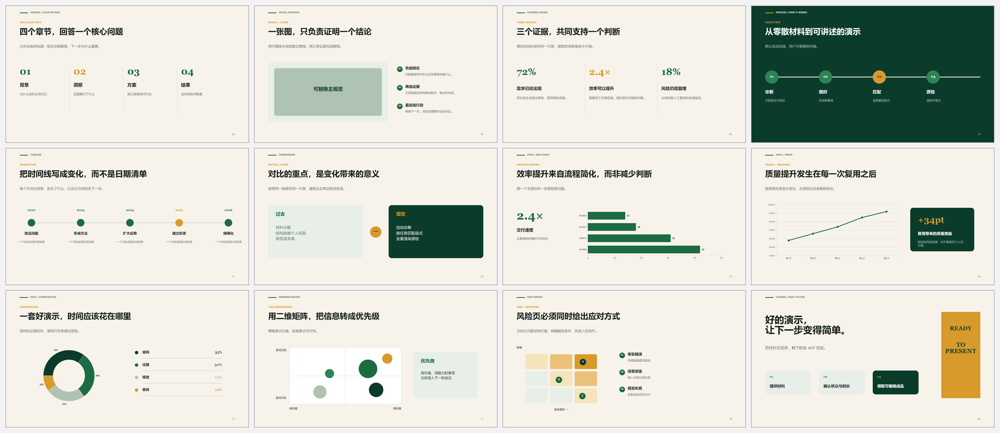

<div align="center">

# PPT Auto Studio

**把材料交进来，把可编辑的高级 PPT 拿走。**  
**Drop in your content. Get a polished, editable presentation.**

`Beginner-first` · `Editable PPTX` · `Automatic storytelling` · `Render QA`

</div>


## 不会设计，也能做好 PPT / Great slides without design skills

这不是“再给你一堆模板，让你自己慢慢挑”。把 Word、PDF、Excel、图片、实验结果、会议笔记或旧 PPT 交给 Skill，它会自动完成内容筛选、故事线、版式匹配、视觉补充、逐页渲染和质量检查。

This is not another template dump. Give the Skill a document, spreadsheet, research result, image set, meeting note, or old deck. It organizes the story, selects layouts, adds useful visuals, builds editable slides, and checks every rendered page.

| 你只需要 / You provide | Skill 自动完成 / The Skill handles |
|---|---|
| 原始材料 / Raw content | 提炼重点、区分正文与附录 / Content triage |
| 听众和时长（知道就说）/ Audience and duration, if known | 故事线、页数与演讲节奏 / Story, slide count, pacing |
| 必须保留的数据和引用 / Required facts and sources | 版式、配色、字体、配图与图表 / Layouts, colors, typography, visuals, charts |
| 一句“我不会，你直接决定” / “I am new—choose for me” | 一个推荐方向，不让用户做专业选择 / One recommended direction |

## 真实版式效果 / Real layout previews

下面全部来自仓库内的可编辑 PPTX 实际渲染结果，不是概念图。

Every preview below is rendered from the editable PPTX included in this repository—not a mockup.



**[下载 20 页可编辑资源包 / Download the editable 20-slide kit](./assets/premium-green-layout-kit.pptx)**

## 内置能力 / What is included

- 20 页原创 16:9 黄绿视觉系统：封面、章节、目录、图文、流程、时间线、对比、研究方法、矩阵、结尾等；  
  20 original 16:9 layouts covering covers, sections, agenda, visual evidence, process, timeline, comparison, research, matrices, and closing.
- 3 类原生可编辑图表：柱状图、折线图、环形图；  
  Editable native bar, line, and doughnut charts.
- 工作汇报、答辩、项目提案、科研分享和管理层简报的自动选页配方；  
  Automatic recipes for reports, thesis defenses, proposals, scientific talks, and executive briefs.
- 本地模板库目录工具，可批量检索页数、比例、图片、图表、动画、字体和主题色；  
  A local template cataloger that indexes slide count, aspect ratio, media, charts, animation, fonts, and theme colors.
- 全套逐页渲染、溢出、遮挡、字体和裁切检查；  
  Full-deck render checks for overflow, overlap, fonts, and image crops.

## 30 秒上手 / 30-second quick start

```text
用 $build-premium-pptx 把这个 Word 和 Excel 做成 10 页工作汇报。
我不会做 PPT，你直接决定结构、版式和配图。
```

```text
Use $build-premium-pptx to turn these notes into an 8-minute research talk.
I am new to PowerPoint, so choose the story, layouts, and visuals for me.
```

Skill 最多只在确实影响结果时询问听众和演讲时长。其余设计决策默认自动完成。

The Skill asks only for audience or duration when they materially affect the deck. Everything else defaults to autopilot.

## 安装 / Installation

```bash
git clone https://github.com/zhoy0409-debug/build-premium-pptx.git
cp -R build-premium-pptx ~/.codex/skills/build-premium-pptx
```

Windows PowerShell:

```powershell
git clone https://github.com/zhoy0409-debug/build-premium-pptx.git
Copy-Item -Recurse .\build-premium-pptx "$env:USERPROFILE\.codex\skills\build-premium-pptx"
```

重启 Codex 后调用 `$build-premium-pptx`。  
Restart Codex, then invoke `$build-premium-pptx`.

## 私有模板库 / Private template libraries

Skill 可以在本地检索和调用用户有权使用的模板，但不会把购买的原始模板、内嵌素材或字体上传到公共仓库。仓库中的 PPTX、版式和展示图均为重新设计的原创资源。

The Skill can privately search templates the user is authorized to use. Purchased source decks, embedded stock assets, and fonts are not redistributed. The public PPTX, layouts, and previews in this repository are original rebuilt resources.

## 文件结构 / Repository map

```text
SKILL.md                              Core autopilot workflow
agents/openai.yaml                    Codex UI metadata
assets/premium-green-layout-kit.pptx  Editable presentation resource kit
assets/showcase-*.png                 Rendered README previews
references/layout-recipes.json        Layout and scenario selection rules
references/design-and-qa.md           Design, data, and QA rules
scripts/catalog_pptx.py               Local template cataloger
scripts/build_premium_resource_kit.mjs Reproducible resource-kit builder
```

> 一页一个结论；证据优先于装饰；保留可编辑性；不虚构数据；没有逐页渲染检查就不算完成。  
> One takeaway per slide. Evidence before decoration. Stay editable. Never invent data. No delivery without full-deck render QA.
